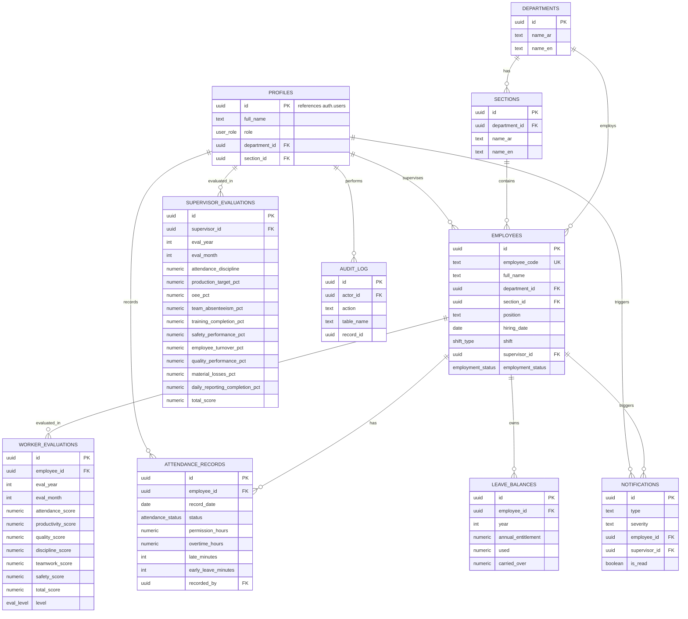

# Entity Relationship Diagram — Workforce Management System

## Notes
- `profiles.id` is a 1:1 extension of Supabase `auth.users` — created automatically via a
  Postgres trigger (`on_auth_user_created`) recommended in `supabase/schema.sql` comments.
- `employees.supervisor_id` references `profiles.id` (a supervisor is a system user, an
  employee is a factory worker — they are separate entities so a supervisor doesn't need
  a worker-style record).
- `worker_evaluations.total_score` is a **generated column** (auto-computed by Postgres);
  `level` is set by the application layer (or an optional trigger) based on the score bands.
- `supervisor_evaluations.total_score` is computed in the application layer using the
  documented KPI weights (see `src/lib/calculations.ts`).
